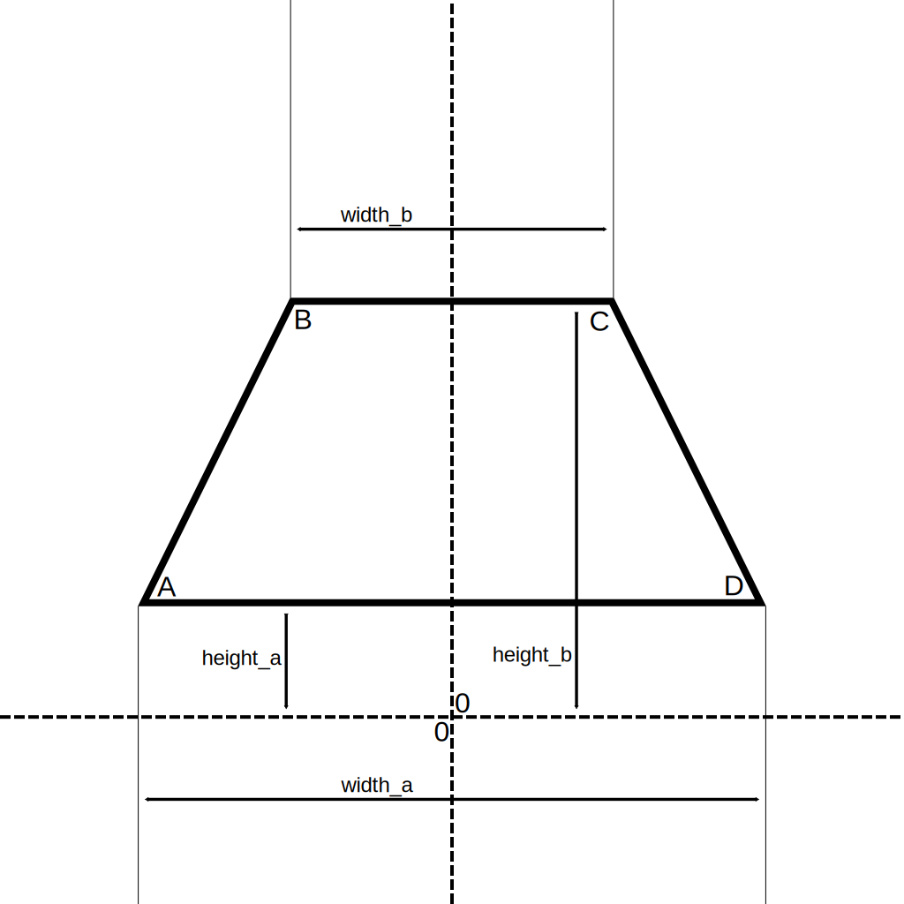

# SimplePipe
`SFS.Parts.Modules.SimplePipe` inherits from `SFS.Parts.Modules.PipeData` and is used to define an isosceles trapezoid mesh.

## Fields
> The isosceles trapezoid ABCD is an isosceles trapezoid with segments AD and BC parallel.

`width_a` defined as a `SFS.Variables.Composed_Float` is used to define the width of AD.

`width_b` defined as a `SFS.Variables.Composed_Float` is used to define the width of BC.

`height_a` defined as a `SFS.Variables.Composed_Float` is used to define the vertical position of AD.

`height_b` defined as a `SFS.Variables.Composed_Float` is used to define the vertical position of BC.

*Simple pipe visualization*

## Fields summary
### SFS.Parts.Modules.Simple
Inherits from `SFS.Parts.Modules.PipeData`
| Name | Type | Description | 
|-|-|-|
| `width_a` | `SFS.Variables.Composed_Float` | Width of segment AD |
| `width_b` | `SFS.Variables.Composed_Float` | Width of segment BC |
| `height_a` | `SFS.Variables.Composed_Float` | Vertical position of segment AD |
| `height_b` | `SFS.Variables.Composed_Float` | Vertical position of segment BC |