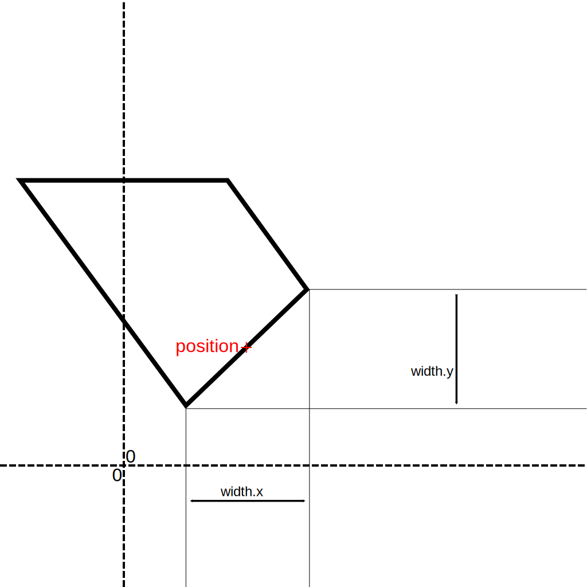

# CustomPipe
`SFS.Parts.Modules.CustomPipe` inherits from `SFS.Parts.Modules.PipeData` defines a complex pipe with multiple segments of different width and rotation.

`CustomPipe` holds a shape `composedShape` defined as a `SFS.Variables.Composed_Shape` which itself contains a list of points in `points` defined as a `List<SFS.Variables.Composed_ShapePoint>`.

Every point is attached to the previous to form a quadrilateral. 

## Composed_ShapePoint
`SFS.Variables.Composed_ShapePoint` holds the point position in `position` defined as a `SFS.Variables.Composed_Vector2` and the point width in `width` defined as a `SFS.Variables.Composed_Vector2`.

`position` defines the position of the center of segment.

The actual width and orientation of the segment is defined `width` which holds the horizontal and vertical sizes.

The actual width can be determined using Pytharogas' theorem on the `x` and `y` components of `width`. (`sqrt(width.x * width.x + width.y * width.y)` or `width.magnitude`).

The orientation can be determined using this equation: `arcsin(width.y / width.magnitude)`.

*Shape point visualization*

## Fields summary
### SFS.Parts.Modules.CustomPipe
Inherits from [`SFS.Parts.Modules.PipeData`](./PipeData.md#sfspartsmodulespipedata)
| Name | Type | Description |
|-|-|-|
| `composedShape` | `SFS.Variables.Composed_Shape` | Mesh |

### SFS.Variables.Composed_Shape
| Name | Type | Description |
|-|-|-|
| `points` | `List<SFS.Variables.Composed_ShapePoint>` | Shape points list |

### SFS.Variables.Composed_ShapePoint
| Name | Type | Description |
|-|-|-|
| `position` | `SFS.Variables.Composed_Vector2` | Position |
| `width` | `SFS.Variables.Composed_Vector2` | Horizontal and vertical width |